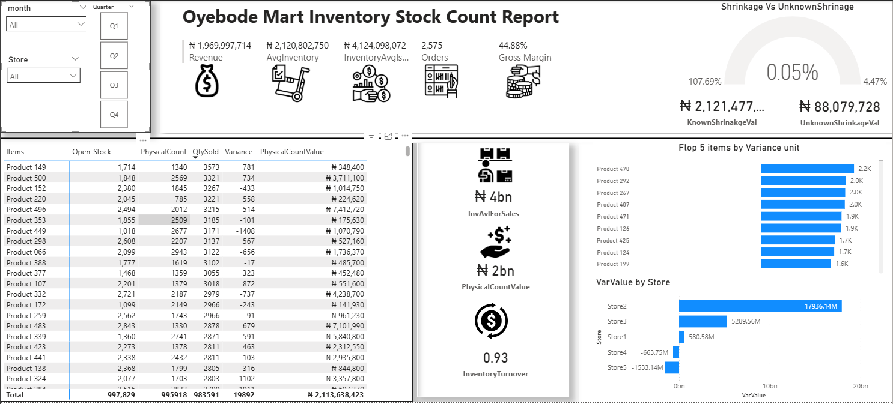

# 📊 Retail Inventory Variance & Shrinkage Analysis (Power BI)

---

## 📌 Overview  
This project presents a **Retail Inventory Stock Count Dashboard** designed to monitor stock accuracy, identify shrinkage, and highlight product-level discrepancies across multiple stores.

It provides real-time visibility into:
- Stock variances between system records and physical counts  
- Shrinkage trends (Known vs Unknown losses)  
- High-risk products and stores contributing to inventory loss  
- Inventory efficiency through turnover metrics  

---

## 🧩 Business Problem  
Retail operations often struggle with:
- Inaccurate stock records due to manual counting errors  
- Untracked transfers between locations  
- Theft, damages, or undocumented stock losses  

These issues lead to:
- Financial leakage  
- Poor replenishment decisions  
- Reduced operational efficiency  

👉 This dashboard helps management **quantify, trace, and reduce inventory losses**.

---

## 📊 Dashboard Highlights  

### 🔑 Key KPIs (Top Section)
- **₦1.96B+ Revenue**
- **₦2.12B Avg Inventory**
- **₦4.12B Inventory Available for Sales**
- **2,575 Orders**
- **44.88% Gross Margin**

---

### 📉 Shrinkage Analysis
- Visual gauge showing **shrinkage rate (~0.05%)**
- Comparison of:
  - **Known Shrinkage (₦2.12B)**  
  - **Unknown Shrinkage (₦88M)**  

👉 Helps distinguish **operational issues vs unexplained losses**

---

### 📦 Product-Level Insights
- Table showing:
  - Opening Stock  
  - Physical Count  
  - Quantity Sold  
  - Variance  
  - Financial impact  

- **Top 5 Products by Variance**
  - Identifies items driving the highest discrepancies  

---

### 🏬 Store-Level Performance
- **Variance Value by Store**
  - Highlights stores with:
    - High positive variance (overstock issues)  
    - Negative variance (possible shrinkage or errors)  

---

### 🔄 Inventory Efficiency
- **Inventory Turnover: 0.93**
  - Indicates how efficiently inventory is being sold  

---

## ⚙️ Data Preparation (Power Query)

To ensure data privacy and usability:
- Store names anonymized → `Store1, Store2...`
- Product names anonymized → `Product 001...`
- Financial values adjusted for confidentiality  

Data transformations:
- Removed null/irrelevant fields  
- Standardized formats  
- Built clean data model for reporting  

---

## 📐 Key Calculations  

- **Expected Stock**  
  `= Opening Stock + Transfers – Sales – Damages`  

- **Variance (Units)**  
  `= Physical Count – Expected Stock`  

- **Variance Value**  
  `= Variance × Unit Cost`  

- **Inventory Turnover**  
  `= Sales ÷ Average Inventory`  

- **Shrinkage %**  
  `= Total Shrinkage ÷ Total Inventory Value`  

---

## 🔍 Key Insights  

- Shrinkage is **low (~0.05%)**, indicating generally strong control  
- However, **unknown shrinkage still exists**, requiring investigation  
- A **small group of products drives most variance** (Pareto effect)  
- Certain stores show **significant variance imbalance**, suggesting:
  - Process gaps  
  - Counting inconsistencies  
  - Possible stock handling issues  

---

## 🛠 Tools Used  
- **Power BI**  
- **Power Query**  
- **Excel**  

---

## 📁 Project Files  
- `Portfolio_Inventory_Project.pbix`  
- `Portfolio_Inventory_Project.xlsx`  
- `dashboard.png`  

---

## ⚠️ Disclaimer  
This project uses **anonymized and modified data** for demonstration purposes.  
All sensitive business information has been removed while preserving analytical integrity.

---

## 💡 Use Case  
This dashboard can be adapted for:
- Supermarkets  
- Pharmacies  
- Warehouses  
- FMCG businesses  

To improve stock accuracy and reduce inventory losses.
